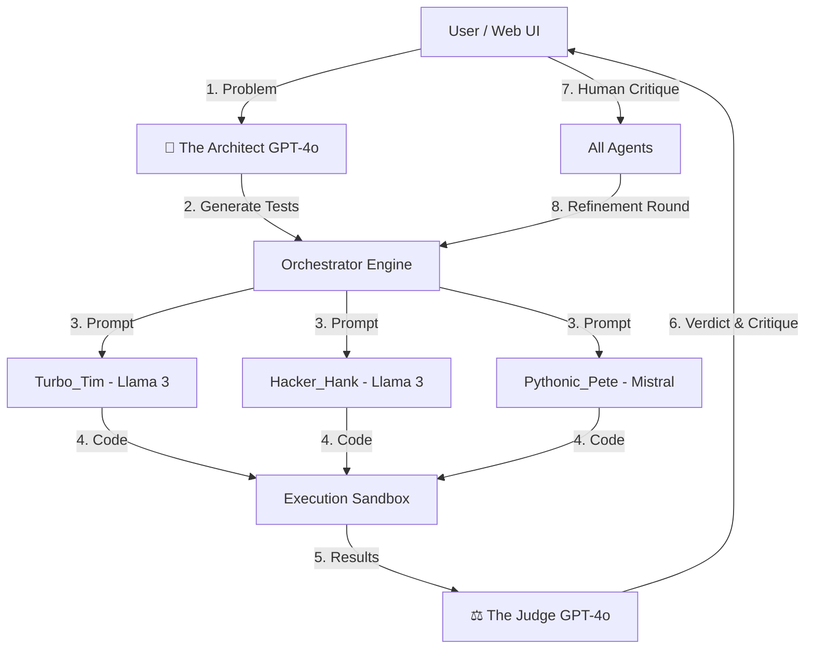

# ⚔️ Code Arena AI: Multi-Agent Coding Tournament

  


**Code Arena AI** is an advanced **Multi-Agent System (MAS)** where AI models compete to solve algorithmic problems. With a **Human-in-the-Loop** architecture, you can watch, critique, and judge battles in real-time via a modern Web UI.

---

## 🌟 Key Features

### 🧠 Hybrid Intelligence
- **The Architect & Judge (Cloud):** Powered by GPT-4o via GitHub Models for high-level reasoning, test generation, and complex code evaluation.  
- **The Competitors (Local):** Llama 3.1 & Mistral via Ollama, running locally for speed and privacy.

### ⚙️ The Architect
- Automatically generates **edge-case test inputs (JSON)** for any problem you type.

### ⚖️ The Supreme Judge
- Evaluates code for:
  - Correctness
  - **Time Complexity** & **Space Complexity**
  - Pythonic style & best practices

### 🎮 Gamified UI
- Real-time battle logs with **syntax highlighting**
- Victory podium with **confetti animation**
- **ELO Rating System** to track champion rankings

### ✋ Human-in-the-Loop
- Pause battles after the Judge's verdict to inject **your critiques** before agents refine their code.

---

## 🛠️ Architecture



---

## 🚀 Installation

### Prerequisites

- **Python 3.10+**
- **Ollama** (installed & running locally)
- **GitHub account** (for free GitHub Models API token)

### 1. Clone & Setup

```bash
git clone https://github.com/yourusername/code_arena_ai.git
cd code_arena_ai

# Create Virtual Environment
python -m venv venv
source venv/bin/activate  # Windows: venv\Scripts\activate

# Install Dependencies
pip install -r requirements.txt
```

### 2. Pull Local Models

```bash
ollama pull llama3.1
ollama pull mistral
```

### 3. Configure API Key

Create a `.env` file in the root directory:

```bash
touch .env
```

Add your GitHub token:

```env
GITHUB_TOKEN=ghp_your_token_here_xxxxxxxxxxxx
```

---

## 🎮 Usage

### Start the Web UI

```bash
python overview/app.py
```

Open your browser at: **http://127.0.0.1:5000**

### How to Play

1. **Arena Tab:** Type a problem (e.g., "Write a function to validate an email address").
2. **Optional:** Leave Input/Output empty to let The Architect generate them.
3. **Click Start:** Watch agents generate code.
4. **Phase 1 Verdict:** The Judge picks a provisional winner.
5. **Intervention (Optional):** Provide manual critiques.
6. **Phase 2:** Agents refine their code based on feedback.
7. **Victory:** The ultimate winner is crowned on the podium!

---

## 📂 Project Structure

```
code_arena_ai/
├── config/
│   ├── agents_config.yaml   # Define Agent Models & Roles
│   └── settings.yaml        # Global settings (Timeouts, Retries)
├── output/
│   ├── battle_logs/         # JSON logs of every battle
│   ├── generated_code/      # Generated .py files
│   └── elo_ratings.json     # Leaderboard data
├── overview/                # Web Application
│   ├── app.py               # Flask Backend
│   └── templates/           # HTML/Tailwind UI
├── prompts/                 # System Prompts for agents
├── src/
│   ├── agents/              # Agent Logic
│   ├── arena/               # Orchestrator / Game Loop
│   ├── judge/               # Execution & Scoring Logic
│   └── llm/                 # Hybrid API Client (Ollama + OpenAI/GitHub)
└── requirements.txt
```

---

## 🔮 Roadmap

### 1. Security: Docker Sandbox 🛡️
- **Current:** Python exec() is risky.
- **Solution:** Use Docker containers for isolated execution with strict timeout and memory limits.

### 2. Tournament Mode ⚔️
- Run auto-battles on 100+ problems.
- Generate a dataset of Winning vs Losing solutions for fine-tuning agents.

### 3. Multi-Language Support 🌐
- Support for Python, JavaScript, Go, etc.
- Architect generates language-agnostic tests.
- Sandbox detects language and runs code in the correct container.

### 4. Fine-Tuning Loop 🧠
- Use winning solutions to fine-tune a local Llama 3 model.
- **Goal:** Create a specialized Code Arena Llama that improves over time.

---

## 🤝 Contributing

1. **Fork** the repository.
2. **Create** a feature branch:
   ```bash
   git checkout -b feature/docker-sandbox
   ```
3. **Commit** your changes.
4. **Push** the branch and open a Pull Request.

---

## 📄 License

This project is licensed under the MIT License - see the [LICENSE](LICENSE) file for details.

---

## ⭐ Star History

If you find this project useful, please consider giving it a star! ⭐
